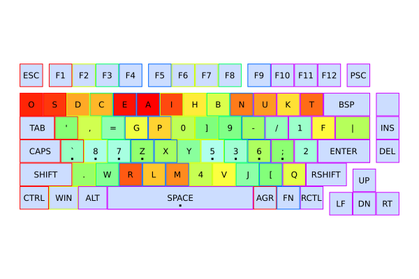
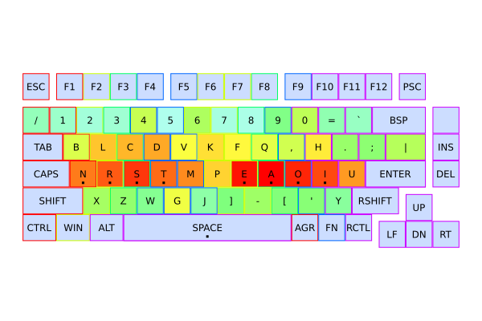
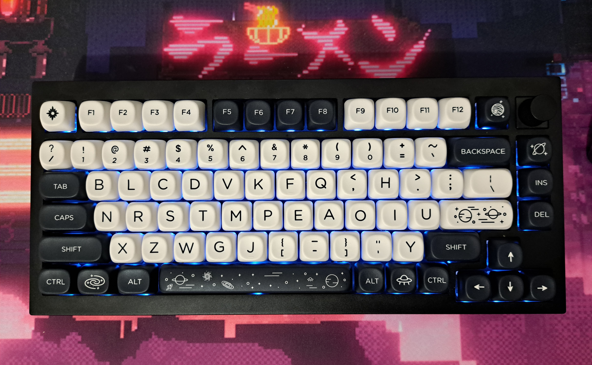

# Keyboard Simulated Annealing Layout Optimizer

Based on the code from this YouTube video: [Why I Made The World's Worst Keyboard](https://youtu.be/188fipF-i5I).

To train on your own custom dataset and customize keyboard layout or algorithm arguments,
copy all your training data (text files) to the folder `persistent/raw_dataset` and
adjust parameters in `persistent/data.json` (some comments explaining it are in `data-commented.json`).

You can cancel execution at any time with CTRL+C and the first and best keyboard generated up to that time will be saved.

## Customizing and training your own custom layout

Download and install the Julia language at <https://julialang.org/downloads/>.

Assuming `julia` is in your path:

For CUDA GPU, run:

```bash
git clone https://github.com/gabrielmaia2/sa-keyboard-layout-optimizer.git
cd sa-keyboard-layout-optimizer
julia --project -L "revise.jl"
main(useGPU=true, findWorst=false)
```

For threaded CPU, change \<nthreads\> for the number of threads your processor can run and run:

```bash
git clone https://github.com/gabrielmaia2/sa-keyboard-layout-optimizer.git
cd sa-keyboard-layout-optimizer
julia -t<nthreads> --project -L "revise.jl"
main(useGPU=false, findWorst=false)
```

To find the worst keyboard layout instead of the best, just change `findWorst=false` to `findWorst=true`.

### Data

Everything in `data` folder is generated, it can be deleted at any time.

The training data from `persistent/raw_data` will be joined together in the file `data/dataset.txt`.

Runs are saved in `data/result`, where `start` folder has the starting keyboards and `end` folder has the final best keyboards.
The keyboards are saved in each folder sorted by the score of the final keyboard for that run, where the first will be the best run and the last the worst run.
`data/result/bestOverall.png` will be the best keyboard of all.

`data/lastRuns` will have the results from previous runs. You can prevent last runs from being saved by setting `"saveLastRuns": false` in `persistent/data.json`.

If you want to see the keyboard updating in realtime, set `"viewKeyboardUpdates": true` in `persistent/data.json`. Note that this impacts performance.

### Customizing parameters

All parameters are in `persistent/data.json`.

#### Adjusting penalty weights

The weights are in `persistent/data.json` and `data-commented.json` has some comments explaining how to edit it. Some hints for adjusting them:

Note that by also adding effortBiases together with effortWeights, you actually have an efforts neuron that can be used to track back (fit) the parameters that get the closest to a specific keyboard layout.

- Distance: More weight favors less finger traveling;
  - Distance is raised to the power of distanceGrowthRate;
  - yScale scales down movements across y axis so that lateral movements (across x axis) will deal more penalty, this reduces lateral movements, it can have some undesirable results for non-ortholinear keyboard layouts;
- Single hand: If you prefer to use a single hand for most words instead of favoring using both, put negative weight in single hand penalty;
- Double finger prevents using same finger twice, will favor putting keys that are not normally written together in the same finger columns;
- FingersCPS and rowsCPS (clicks per second) penalties favor your strongest fingers and the strongest rows of the keyboard;
  - RowsCPSBias biases specific rows, even if your CPS in that specific row isn't the best, I used it to remove a little bit the home row and increase the bias of the row below it;
- Left hand reward favors using left hand, let it 0 if you don't want it or negative to favor right hand;

## Motivation

What i changed in the code:

- Organized code: Organized and separated code in multiple files to make it easier to understand and to work with;
- Improved displaying layouts;
- Improved customizability and specializability: Allowed using custom keyMaps and keyboard layouts and customizing other arguments in `persistent/data.json`;
- Improved maintenance and updates:
  - Use Revise.jl in Julia REPL to make it easier and faster to make updates and rerun;
  - Use json for changing arguments without updating code;
- Improved performance:
  - Improved overall code performance by changing some operations or bad practices;
  - Cached some rewards to prevent needless computations;
  - Implement parallelization using multithreads in CPU or CUDA in GPU and allow to choose one of them;
- Customized weights;
- One of the keyboards starts with an optimized layout from char frequencies;

Why did I do it: I used this project to learn Julia (with CUDA and multithreading), and because I wanted to create my own custom layout with my own custom rewards.
One thing I wanted to tweak in special was the rewards for using both hands, since it favored using a single hand to write most words, which reduces writing speed.

### Performance results

Benchmark with 10000 iterations:

- Specs: AMD Ryzen 5 5600X (12 cores, 24 threads), NVidia GeForce RTX 4060 Ti 8GB, Fedora 39;
- Old code: 273.680406s;
- New code (with CPU, single thread): 120.886688s;
- New code (with CPU, 24 keyboards one in each thread): 362.078500s (~ 15.086604s per keyboard);
- New code (with GPU): 8.069193s;
- New code (with GPU, after compiled): 6.631457s;

Note that there is still a lot of room for improvement.

## Training with my own data

I trained my layout with the parameters specified in `persistent/data.json` and my own custom dataset.
The results can be seen in `results/` folder.

The keyboard layout I used was from the Keychron Q1 Pro keyboard.

Parameters: 20 keyboards and 25000 iterations.

Best and worst layouts:




### Analyzing results

The more frequent letters are exactly in the home keys and around them.
The keys in the two rows between the home keys which are not in the home row have a low frequency.
This happened because of both the distance and growth rate which is diagonal and because of the `yScale` parameter.

The vowels are always in one of the hands and most letters are on the opposite hand.
This happens to maximize alternating hands when writing, since in Latin-derived languages
vowels alternate with consonants. This will highly likely have a different result if used in an idiom
which is not based in Latin.

It is interesting how we can notice, with leftHand reward set to zero,
the transition between the vowels in the left hand (the best ones) to the right hand (the worst ones),
since the hand that uses vowels alternates with the other hand, thus, writing less overall,
which conforms with the standard of a weaker left hand, which was considered when designing layouts such as Dvorak,
which concentrates finger usage way more in the right hand, as opposed to QWERTY, which uses the left hand more.

Interestingly, the letters 'H' and 'Y' is together with the vowels.
That highly likely happened, especially for 'H',
because these are the letters (apart from the vowels) which are neighbor to

### Final layout

The layout i ended up with was a modified version of the layout 9 (where i switched the keys '[' and '\]'),
because I prefer to have most consonants in the left hand,
since most keyboard shortcuts are consonants.

Layout 9:



Final keyboard:


